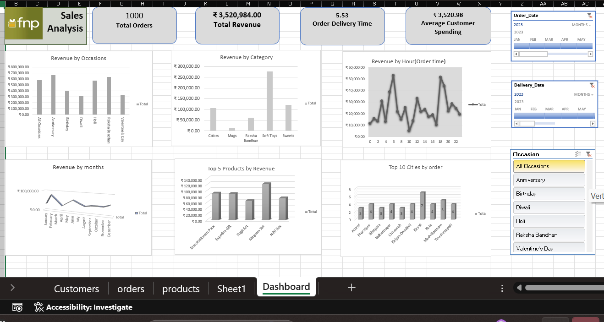

# 📊 FNP Sales Analysis Dashboard 2023

An interactive Sales Analysis Dashboard built in Microsoft Excel using Pivot Tables, Pivot Charts, KPI Cards, and Slicers to analyze FNP (Ferns N Petals) sales data from 2023.

---

# 📌 Project Overview

This dashboard was created to analyze sales performance, customer behavior, product trends, delivery insights, and city-wise order distribution using Excel-based data analytics techniques.

The project transforms raw sales data into meaningful visual insights through interactive charts and dynamic filters.

---

# 🖼 Dashboard Preview

---

# 📊 Key Metrics

* Total Orders
* Total Revenue
* Average Order-Delivery Time
* Average Customer Spending

---

# 📈 Dashboard Features

## Revenue by Occasions

Analyzes sales performance across different occasions:

* Anniversary
* Birthday
* Diwali
* Holi
* Raksha Bandhan
* Valentine’s Day

## Revenue by Category

Compares revenue generated across product categories such as:

* Colors
* Mugs
* Raksha Bandhan Gifts
* Soft Toys
* Sweets

## Revenue by Hour

Tracks customer ordering patterns by time of day.

## Revenue by Month

Shows monthly sales trends and seasonal performance.

## Top 5 Products by Revenue

Identifies the highest revenue-generating products.

## Top 10 Cities by Orders

Analyzes geographical distribution of customer orders.

---

# 🎛 Interactive Filters

The dashboard includes slicers for:

* Order Date
* Delivery Date
* Occasion

These filters dynamically update all charts and KPIs.

---

# 🛠 Tools & Skills Used

* Microsoft Excel
* Pivot Tables
* Pivot Charts
* Slicers
* Data Cleaning
* KPI Reporting
* Data Visualization

---

# 📂 Dataset Sheets

* Customers
* Orders
* Products
* Dashboard

---

# 📌 Business Insights

This dashboard helps identify:

* High-revenue occasions
* Best-selling products
* Customer spending patterns
* Peak order timings
* High-performing cities
* Monthly revenue trends

---
# 👩‍💻 Author

Samiksha Sakpal

Aspiring Data Analyst passionate about:

* Data Visualization
* Business Analytics
* Excel Dashboards
* Supply Chain Analytics

---

# ⭐ Project Purpose

This project was built as part of my Data Analytics learning journey to strengthen practical skills in Excel dashboard development and business data analysis.
